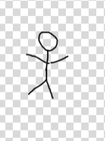

Чтобы попасть в ИТ, надо проложить мост из привычного мира в мир ИТ-абстракций. 
Мост необычный. Он состоит из нескольких ступеней, на которые надо взобраться, и тогда откроется огромный мир ИТ. 

Абстракция или абстрактное представление - это упрощенное описание предмета/объекта. 
Абстрагирование - это процесс создания абстрактного представления.

Чертеж дома - это тоже абстрактное представление дома, которое включает информацию, необходимую инженерам.

Внутри компьютеров любая информация представлена в виде чисел. 
Например, прямоугольник представлен в виде четырех чисел, где первые два числа - это координаты левого верхнего угла, а третье и четвертое числа - это ширина и высота прямоугольника.
