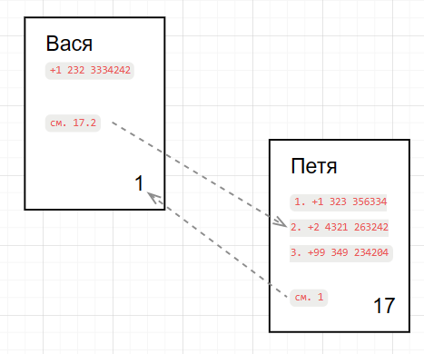

# 1

Возьмем привычный предмет - блокнот с пронумерованными страницами: Страница 1, …, Страница 100.

Если мы хотим записать телефон Васи, то например, на странице 1 пишем: `Вася +1 232 3334242`. Оставшуюся часть страницы 1 оставим пустой, чтобы позже мы могли добавить разные заметки, связанные с Васей. 

Точно так же мы записываем в блокнот остальные контакты. 

Например, телефон Пети оказывается записан на странице 17.

В какой-то момент мы узнаем, что Вася как-то связан с Петей. То есть надо на странице Васи как-то сослаться на страницу Пети. 

Для этого на странице Васи, то есть на странице 1 мы пишем, например: `17 Петя`, или `см. 17` или просто `17`.

   
   Абстрактное представление страниц блокнота.
   Пунктирная линия - это воображаемая линия для удобства восприятия ссылок.

В такой ситуации в ИТ говорят, что у Васи есть прямая ссылка на Петю, или Вася ссылается на Петю.

Если на странице Пети мы поставим ссылку на Васю, то есть на странице 17 напишем: `см 1`, то можем сказать, что мы связали ссылками Васю и Петю. Также можем сказать, что на Васю ведет обратная ссылка со страницы Пети.

Надо заметить, что мы говорим Петя - подразумеваем страница 17.  Говорим Вася - подразумеваем страница 1. 

Также можем сказать, что страницы имеют имена. А еще можем сказать, что порядковый номер страницы - это  адрес страницы в блокноте.

Когда мы запишем в блокнот все наши 100 контактов и свяжем их прямыми и обратными ссылками, то мы можем увидеть, что например, на Петю ведут 25 ссылок, и это больше, чем у других контактов. Значит, Петю можно считать ключевой фигурой в нашем блокноте.

Как быть, если у Пети есть несколько телефонов, а Вася должен звонить только на определенный номер телефона? 
Для этого можем на странице Пети записать его номера телефонов в виде вертикального списка. Каждая строка в этом списке будет иметь порядковый номер. Например, так:

>1.   +1 323 356334  
>2.   +2 4321 263242  
>3.   +99 349 234204  

А на странице Васи мы пишем, например, так: `17.2` - где 2 это номер строки, в которой записан номер телефона `+2 4321 263242`.

Если этот номер сменится, то в строке 2 мы просто зачеркнем старый номер, а рядом напишем новый.

В ИТ такой список называют массивом. Порядковый номер называют индексом. И индекс начинается с 0.

Такой “блокнот” в ИТ называется CRM (Customer relationship management), и в нем содержится вся информация, которую компания смогла собрать на своего клиента, включая телефоны, адреса электронной почты, номера банковских карт, списки покупок, адреса доставки, дату рождения, семейное положение, и т.д.