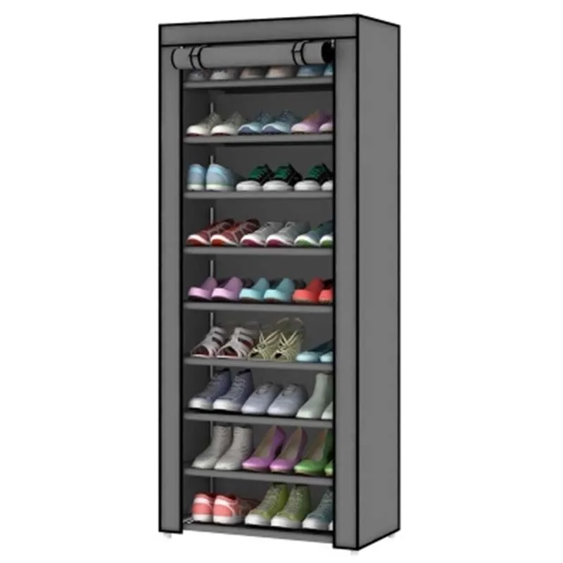

# 2 

Рассмотрим обычный предмет - шкаф для обуви. Он состоит из одинаковых полок.

Представим себе, что полки могут вмещать 16 пар или 32 пары обуви. Количество всегда кратно двум, то есть количество делится на 2 без остатка.

Для удобства, эти полки также имеют свои номера, чтобы можно было ссылаться на полку. Например, сказать: моя обувь находится на полке 9.  
В мире ИТ такой шкаф называется памятью. Полка называется ячейкой. А номер ячейки - называется адресом. 

Размер ячейки считается в битах. То есть ячейка вмещает 64 бита (для 32 пар обуви).  

&#x1F449;  8 бит называются байт.

Если память компьютера состоит из ячеек по 64 бита каждая, то говорят, что у компьютера 64-битная архитектура.

В ИТ емкость памяти считают так: 1024 байт - это 1 Кбайт. 1024 Кбайт - 1 Мбайт. 1024 Мбайт - 1 Гбайт.

Например, 32 Гбайт памяти - это 32 Гбайт * 1024 Мбайт = 32 768 Мбайт или 274 877 906 944 бит. 
Значит в 64-битном компьютере с 32 Гбайт памяти есть 4 294 967 296 ячеек (= 274 877 906 944 / 64).

У каждой ячейки есть свой адрес.

Память бывает оперативной (RAM) и постоянной (HDD, SSD). По сути эта память аналогична RAM, но физически организована иначе и работает медленнее, чем RAM.