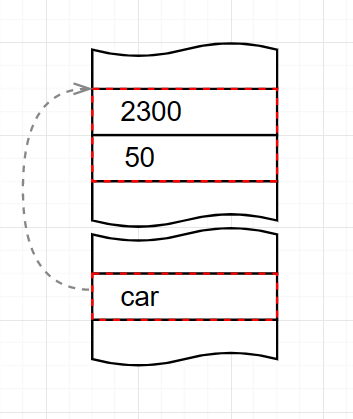

# 7

Компьютер может выполнять арифметические операции (сложение, вычитание, умножение и деление) с содержимым ячеек памяти, также может копировать числа из одной ячейки в другую. Надо заметить, что при удалении числа из ячейки, она заполняется нулями.

В компьютерах памятью управляет CPU (central processing unit / процессор). Он может копировать содержимое из одной ячейки в другую. Также может выполнять различные арифметические операции над числами. Для этого содержимое ячеек копируется в CPU, а результат вычислений копируется обратно в память.

Конечно, CPU не сам выполняет операции, а по командам, известным CPU. Например, для копирования числа из одной ячейки в другую, CPU надо указать команду, условно говоря, с номером 4, а также указать адреса ячеек памяти.

Обработка информации подразумевает выполнение множества разных операций с числами.

Например, в физике есть формула для вычисления кинетической энергии `Ek` движущегося тела массой `m` и скоростью `v` — `Ek = 0.5 * m * v^2`.  Надо заметить, что для формулы нужны только два параметра/свойства какого-то объекта, например, автомобиля или астероида. То есть мы абстрагируемся  от автомобиля или астероида.

На языке JavaScript эту формулу можем записать в виде следующего кода. 

```jsx
function Ek (m, v) { 
	return (0.5 * m * v^2); 
}
```

function - ключевое слово в языке JavaScript. Используется для определения новой функции.
То, что указано в круглых скобках, называют параметрами или аргументами.

Для того, чтобы получить результат вычисления формулы для тела ‘car’ массой `m=2300` и скоростью `v=50`, пишем так: 

```jsx
let car = Ek(2300, 50);
```

Для тела ‘asteroid’ c массой `m=1123122300` и скоростью `v=13230`, пишем так:

```jsx
let asteroid = Ek(9173123382, 13230);
```

Мы можем назвать функцию иначе и переименовать параметры, например, так: 

```jsx
function getKineticEnergy (mass, velocity) {   
	return (0.5 * mass * velocity^2); 
}
```

Тогда вызов функции также надо переименовать: 

```jsx
let car = getKineticEnergy(2300, 50);
```

Обычно в больших программах есть сотни и тысячи функций. Одна функция вызывает другую, а та вызывает третью функцию и так далее. 

Мы можем определить функцию, которая вызывает другие функции, например, так:

```jsx
function getDiffEk (mass1, velocity1, mass2, velocity2) { 
	let ek1 = getKineticEnergy(mass1, velocity1);    
	let ek2 = getKineticEnergy(mass2, velocity2); 
	return (ek1 - ek2);  
}
```

В функцию `getDiffEk` мы можем передать параметры ‘car’ и ‘asteroid’.

```jsx
let dEk = getDiffEk(2300, 50, 1123122300, 13230);  
```

Если мы хотим передать параметры ‘asteroid’ и ‘car’, то надо изменить вызов функции на следующий:

```jsx
let diffEk = getDiffEk(1123122300, 13230, 2300, 50);         
```

Если посмотреть на вызов этой функции, например, через неделю, то мы не будем помнить, что значат числа: `1123122300, 13230, 2300, 50`.

В JavaScript есть возможность сделать код более понятным. Для этого параметры объектов можем объединить.

```jsx
let car = { mass: 2300, velocity: 50 }; 
let asteroid = { mass: 1123122300, velocity: 13230};
```

<div style="float: right; margin-left: 20px; width: 200px; text-align: center;">
   
   Абстрактное представление объекта ‘car’ и ссылка на ячейки памяти, занятые этим объектом показаны на схеме; 
   car - записано как слово - это для простоты восприятия, хотя в реальности записаны числа из Unicode. 
</div>

Из-за того, что мы поменяли часть кода выше, надо переписать вызов функции: 

```jsx
let diffEk = getDiffEk(asteroid.mass, asteroid.velocity, car.mass, car.velocity);    
```

Вместо чисел в коде указаны имена, и очевидно, код стал понятнее.

Но можно сделать код еще более понятным. Например, записать вызов так:

```jsx
let diffEk = getDiffEk(asteroid, car);    
```

Тут мы в функцию передаем ссылку на объекты `asteroid` и `car`.

Но в таком случае надо переписать код самой функции, например, так: 

```jsx
function getDiffEk (object1, object2) { 
	let ek1 = getKineticEnergy(object1.mass, object1.velocity); 
	let ek2 = getKineticEnergy(object2.mass, object2.velocity); 
	return (ek1 - ek2); 
}
```

Переписывание кода называется рефакторинг. И является обычным явлением при разработке кода.